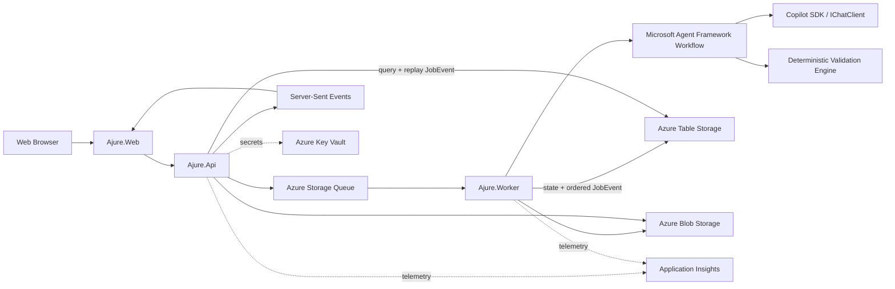

# TRD - 아주르

## 1. 목적과 경계

이 문서는 아주르 웹 앱의 구현 구조를 정의한다. 아주르의 실행 결과는 Markdown 명세이며 제품 소스 코드가 아니다.

### 필수 기술 조건

- Microsoft Agent Framework를 실제 작성·평가·회귀 워크플로에 사용한다.
- GitHub Copilot SDK를 모델 세션에 사용한다.
- 모델 호출 경계는 가능한 범위에서 `IChatClient`로 표준화한다.
- .NET Aspire AppHost로 로컬 토폴로지와 Azure 리소스를 구성한다.
- Aspire 기반 워크플로를 Azure Container Apps에 배포한다.

### 설계 원칙

1. 문서 4종을 따로 생성하지 않고 하나의 `ProjectSpec`에서 렌더링한다.
2. LLM 평가만 신뢰하지 않고 결정적 검사와 외부 벤치마크를 함께 사용한다.
3. 작성자와 평가자의 컨텍스트 및 역할을 분리한다.
4. 사용자의 승인 버전은 불변으로 보존한다.
5. 모델에는 코드 작성, 셸 실행, 저장소 수정 도구를 제공하지 않는다.

## 2. 논리 아키텍처



## 3. 런타임 구성요소

### 3.1 `Ajure.Web`

- React, TypeScript, Vite 기반 SPA
- 아이디어 입력, 대상 선택, 질문 응답, 문서 편집, 점수/회귀 시각화 담당
- Markdown 렌더러와 안전한 텍스트 편집기를 제공
- API 이외의 모델/저장소 자격증명을 보유하지 않음

### 3.2 `Ajure.Api`

- ASP.NET Core API
- 인증, 프로젝트/버전 조회, Job 생성, 문서 편집, 내보내기 담당
- Table에 저장된 `JobEvent`를 Server-Sent Events(SSE)로 재생해 진행 상태 전달
- `Last-Event-ID` 이후 이벤트를 재생하므로 새로고침과 API replica 변경 후에도 이어보기 지원
- 모델 호출과 장시간 검증은 직접 수행하지 않고 Queue에 위임

### 3.3 `Ajure.Worker`

- Queue 기반 장시간 Job 실행
- Microsoft Agent Framework 워크플로 실행
- 결정적 검사, LLM 평가, 보정, 렌더링, 스냅샷 저장 담당
- Job ID를 멱등 키로 사용
- 각 상태 전이 전에 단조 증가 sequence를 가진 `JobEvent`를 영속 저장

### 3.4 `Ajure.Agent`

- Agent Framework 에이전트 정의와 워크플로 그래프
- 프롬프트 템플릿, 구조화 출력 계약, 역할별 컨텍스트 제한
- 코드나 셸 도구를 등록하지 않음

### 3.5 `Ajure.Specification`

- `ProjectSpec` 도메인 모델
- 요구사항 그래프, 렌더러, 영향 분석, 의미 diff
- AI 제공자에 의존하지 않는 순수 애플리케이션 로직

### 3.6 `Ajure.Validation`

- 스키마, 추적성, 필수 섹션, 파일 경로, 버전 해시 등 결정적 검사
- 평가 결과 집계와 Hard Gate 판정
- [EVALUATION.md](EVALUATION.md)의 산식을 단일 기준으로 구현

### 3.7 `Ajure.Infrastructure`

- Azure Blob/Queue/Table, Key Vault, OpenTelemetry 구현
- Copilot SDK 연결과 `IChatClient` 어댑터
- 대상 도구 템플릿 레지스트리 로더

### 3.8 `Ajure.AppHost` / `Ajure.ServiceDefaults`

- Aspire 리소스, 참조, 엔드포인트, Health Check, Telemetry 기본값 선언
- 로컬에서는 Azurite 등 개발 리소스 사용
- Azure에서는 관리형 리소스로 치환

## 4. Microsoft Agent Framework 워크플로

### 4.1 에이전트 역할

| 에이전트 | 입력 | 출력 | 책임 |
|---|---|---|---|
| Intake Agent | 사용자 원문 | 구조화 Brief | 사실, 선호, 제약 추출 |
| Ambiguity Agent | Brief | Decision 목록 | 구현 결과를 바꾸는 미결정 사항 분류 |
| Spec Architect | 승인된 Decision | `ProjectSpec` 초안 | 목표, 요구사항, 수용 기준, 기술 결정 생성 |
| Product Reviewer | ProjectSpec | Product Findings | 사용자 흐름, 범위, 수용 가능성 검사 |
| Technical Reviewer | ProjectSpec | Technical Findings | 구조, 데이터, API, 보안, 운영 가능성 검사 |
| UX Reviewer | ProjectSpec | UX Findings | 상태, 반응형, 접근성, 상호작용 누락 검사 |
| Implementation Simulator | ProjectSpec + Target | Simulation Findings | 코드를 쓰지 않고 예상 구현 작업/파일 지도를 만들어 빈틈 탐지 |
| Regression Reviewer | Base + Candidate | Regression Findings | 요구사항 손실, 약화, 충돌 검사 |
| Repair Agent | Findings + ProjectSpec | 수정된 ProjectSpec | 사용자 결정이 불필요한 결함만 보정 |
| Target Adapter Agent | 검증된 ProjectSpec | 대상 지침 payload | 도구별 실행 계약 렌더링 입력 생성 |

### 4.2 상태 그래프

```text
Draft
  -> Analyzing
  -> NeedsDecision (Critical 질문 존재)
  -> Generating
  -> DeterministicValidation
  -> IndependentReview
  -> RegressionValidation (기준 버전이 있을 때)
  -> Repairing (최대 3회)
  -> Ready

실패 분기:
  Any State -> RetryableFailure -> 이전 체크포인트
  Any State -> TerminalFailure
  Validation -> NeedsDecision
```

### 4.3 역할 분리

- Spec Architect가 자신의 결과에 최종 합격 판정을 내리지 못하게 한다.
- Reviewer는 작성자의 숨은 추론이나 대화 전체를 받지 않고 `ProjectSpec`과 명시된 평가 기준만 받는다.
- 구현 시뮬레이터는 소스 코드를 생성하지 않고 작업 분해, 의존성, 예상 파일, 검증 항목만 구조화해 반환한다.
- Repair Agent는 Finding이 가리키는 범위 밖의 제품 결정을 바꾸지 못한다.

## 5. Copilot SDK와 `IChatClient` 사용

### 5.1 Copilot SDK 역할

GitHub Copilot SDK의 `CopilotClient`를 프로그래밍 방식의 모델 세션으로 사용한다.

- SDK에 포함된 기본 runtime을 Worker의 자식 프로세스로 실행하거나 공식적으로 지원되는 원격 연결을 사용
- 문서 작성 및 평가 세션 시작
- 선택 모델 지정
- 구조화 프롬프트 전송과 이벤트 수신
- 세션별 작업 디렉터리/로그/Telemetry 설정
- Azure에서는 SDK의 `GitHubToken` 옵션에 Key Vault의 최소 권한 서비스 자격증명을 런타임 주입
- Copilot SDK는 최소 Spec Architect와 독립 Reviewer 한 단계에서 반드시 성공해야 하며, 이 단계를 건너뛴 결과는 Ready가 될 수 없음

`CopilotClient`의 Worker replica당 수명, 세션 동시성, child process 수는 부하 테스트로 결정한다. 공식적으로 안전한 경우 장수명 client와 Job별 session을 사용하고, 그렇지 않으면 제한된 client pool로 프로세스 수를 통제한다.

### 5.2 코드 작성 방지

- 세션에 파일 쓰기, 셸, Git, 배포 도구를 제공하지 않는다.
- `AvailableTools`를 문서 생성에 필요한 안전한 내부 조회 도구로 제한한다.
- 출력은 Markdown 또는 구조화된 `ProjectSpec` 스키마만 허용한다.
- 코드 펜스가 필요한 경우 API 계약/데이터 예시/디렉터리 구조로 용도를 제한한다.
- 실제 제품 구현을 요청받아도 Spec Architect가 요구사항으로 변환한다.

### 5.3 `IChatClient` 경계

Agent Framework의 `ChatClientAgent`/`AsAIAgent` 패턴과 호환되도록 모델 호출을 `IChatClient` 중심으로 구성한다. Copilot SDK에 직접 `IChatClient` 구현이 제공되지 않는 버전이면 얇은 어댑터를 `Ajure.Infrastructure`에 둔다.

어댑터 책임:

- `ChatMessage`와 Copilot SDK 메시지 변환
- 스트리밍/완료 이벤트를 표준 응답으로 변환
- 취소, 제한 시간, 모델 오류를 명시적 예외로 변환
- 도구 호출은 허용 목록과 대조
- 세션 정리 보장

패키지 버전과 API 표면은 구현 시 공식 NuGet 및 Microsoft Learn을 다시 확인해 잠근다.

보조 평가자는 다른 `IChatClient` 제공자를 사용할 수 있지만 Copilot SDK 필수 단계를 조용히 대체해서는 안 된다. Copilot SDK 단계가 인증, 정책 또는 런타임 문제로 실패하면 Job은 명시적으로 실패한다.

### 5.4 P0 Copilot SDK 호스팅 검증 게이트

Copilot SDK는 전체 생성 경로의 필수 의존성이므로 본 구현보다 먼저 다음 Spike를 통과해야 한다.

1. SDK 기본 runtime을 포함한 Linux 컨테이너를 빌드한다.
2. 대화형 로그인 없이 Key Vault에서 주입한 `GitHubToken`으로 인증한다.
3. Azure Container Apps에서 client 시작, session 생성, 응답 수신, 정상 종료를 확인한다.
4. 동시에 여러 격리 session을 실행해 데이터 혼합, 프로세스 수, 메모리, 제한, 재시도를 측정한다.
5. 서비스 자격증명으로 다중 사용자 요청을 처리하는 방식이 GitHub 라이선스와 이용 약관상 허용되는지 문서로 확인한다.
6. 예상 요청량의 비용/쿼터와 조직 정책을 확인한다.

이 게이트가 실패하면 Copilot SDK 필수 조건을 충족할 수 없으므로 다른 제공자로 몰래 대체해 구현을 계속하지 않는다. 대회 운영진과 아키텍처 조건을 재확인할 때까지 프로젝트 구현을 Blocked로 표시한다.

## 6. 정규화된 명세 모델

### 6.1 주요 엔터티

```text
Project
  id, name, ownerId, locale, createdAt

SpecVersion
  id, projectId, number, status, baseVersionId, inputHash
  generationProfile, targetIds, createdAt, approvedAt

ProjectSpec
  vision, problem, personas[], goals[], nonGoals[]
  journeys[], requirements[], nonFunctionalRequirements[]
  acceptanceCriteria[], technicalDecisions[], uxDecisions[]
  risks[], glossary[], openDecisions[]

Requirement
  id, title, statement, priority, rationale
  acceptanceCriteriaIds[], technicalDecisionIds[], sourceDecisionIds[]

AcceptanceCriterion
  id, given, when, then, verificationType, requirementIds[]

TechnicalDecision
  id, title, decision, rationale, alternatives[], requirementIds[]

Artifact
  id, specVersionId, kind, targetId?, path, contentHash
  templateVersion, status, blobUri

ValidationRun
  id, specVersionId, baseVersionId?, iteration, status
  score, hardGates[], findings[], startedAt, completedAt

JobEvent
  jobId, sequence, eventType, stage, status, summary
  occurredAt, retryable, correlationId
```

### 6.2 안정적인 ID

- 기능: `FR-001`
- 비기능: `NFR-001`
- 수용 기준: `AC-001`
- 기술 결정: `TD-001`
- UX 결정: `UX-001`
- 리스크: `RISK-001`

문구 수정만으로 ID가 바뀌지 않는다. 의미가 분리되거나 합쳐질 때는 변경 이벤트를 남긴다.

### 6.3 소스 오브 트루스

`ProjectSpec`이 유일한 의미 기준이다. Markdown을 직접 편집하면 파서가 변경 제안을 만들고, 승인 후 새 ProjectSpec 버전으로 반영한다. 렌더러는 새 버전에서 모든 영향을 받은 파일을 다시 만든다.

## 7. 문서 렌더링

### 7.1 렌더링 순서

1. ProjectSpec 스키마 검증
2. [DOCUMENT-SPEC.md](DOCUMENT-SPEC.md)에 따라 `IDEATION.md` 렌더링
3. 같은 규격에 따라 `PRD.md` 렌더링
4. 같은 규격에 따라 `TRD.md` 렌더링
5. 대상별 지침 payload 생성
6. 대상별 파일 어댑터 렌더링
7. 모든 파일의 버전/해시 매니페스트 저장

### 7.2 문서 우선순위

대상 지침 파일에 충돌 해결 순서를 포함한다.

1. 사용자 최신 명시 요청
2. 대상 지침 파일의 실행/검증 규칙
3. `PRD.md`의 제품 행동과 수용 기준
4. `TRD.md`의 기술 제약과 운영 조건
5. `IDEATION.md`의 배경과 의도

지침 파일이 제품 요구사항을 재정의하지 못하게 한다.

## 8. 검증 엔진

### 8.1 결정적 검사

- JSON 스키마 및 필수 필드
- 요구사항 ID 유일성
- FR/NFR -> AC 연결률
- FR/NFR -> TD 또는 “기술 영향 없음” 표기
- 문서별 필수 섹션
- 대상별 파일 경로와 frontmatter
- 동일 Spec Version과 content hash
- Critical Decision 미해결 여부
- 금지된 비밀/토큰 패턴
- 과도한 중복과 길이 예산

### 8.2 의미 검사

- 상충하는 사용자 흐름
- 정의되지 않은 도메인 용어
- 검증 불가능한 수용 기준
- UI 상태 누락
- 인증/권한/데이터 보존 누락
- 외부 연동의 실패/제한 처리 누락
- 기술 결정 없는 기능 요구사항
- 요구하지 않은 과도한 기술 구성

### 8.3 회귀 검사

기준 버전의 요구사항 그래프와 후보 그래프를 비교한다.

- Removed: 요구사항이 사라짐
- Weakened: 조건/결과/검증 강도가 낮아짐
- Unlinked: 추적 관계가 끊김
- Contradicted: 새 결정이 기존 요구와 충돌
- StaleArtifact: 대상 파일이 이전 버전을 참조
- ApprovedChange: 사용자가 명시적으로 승인한 변경

세부 산식은 [EVALUATION.md](EVALUATION.md)를 따른다.

## 9. API 설계

| Method | Path | 목적 |
|---|---|---|
| `POST` | `/api/projects` | 프로젝트 생성 |
| `GET` | `/api/projects` | 프로젝트 목록 |
| `GET` | `/api/projects/{projectId}` | 프로젝트 상세 |
| `POST` | `/api/projects/{projectId}/analyze` | 원문 분석 Job 시작 |
| `GET` | `/api/projects/{projectId}/decisions` | 질문/결정 목록 |
| `PUT` | `/api/projects/{projectId}/decisions/{id}` | 답변 또는 추천값 승인 |
| `POST` | `/api/projects/{projectId}/versions` | 새 명세 버전 생성 |
| `POST` | `/api/spec-versions/{versionId}/generate` | 생성/검증 Job 시작 |
| `GET` | `/api/jobs/{jobId}` | Job 상태 |
| `GET` | `/api/jobs/{jobId}/events` | SSE 진행 이벤트 |
| `GET` | `/api/spec-versions/{versionId}/artifacts` | 문서 목록 |
| `GET` | `/api/artifacts/{artifactId}` | 문서 내용 |
| `PUT` | `/api/artifacts/{artifactId}` | 사용자 편집 제안 저장 |
| `POST` | `/api/spec-versions/{versionId}/validate` | 재검증 |
| `GET` | `/api/validation-runs/{runId}` | 점수/게이트/Finding |
| `GET` | `/api/spec-versions/{versionId}/diff/{baseId}` | 버전 의미 diff |
| `POST` | `/api/spec-versions/{versionId}/export` | Ready ZIP 생성 |

### 오류 형식

모든 오류는 `code`, `message`, `correlationId`, `retryable`, `details`를 가진 Problem Details 형식을 사용한다. 모델 원문 오류나 자격증명은 응답하지 않는다.

### SSE 재연결 규칙

- Worker는 상태를 사용자에게 노출하기 전에 `JobEvent`를 저장한다.
- 이벤트 ID는 Job 내에서 단조 증가하는 sequence다.
- API는 연결 시 `Last-Event-ID` 이후 이벤트를 먼저 재생한 뒤 1초 간격으로 새 행을 조회한다.
- 15초마다 heartbeat를 보내 중간 프록시의 idle timeout을 방지한다.
- Terminal event 이후 스트림을 닫는다.
- 이 구조는 in-memory backplane에 의존하지 않아 Container Apps의 다른 API replica로 재연결해도 동작한다.

## 10. 저장소 설계

### Azure Blob Storage
- Markdown 산출물
- Export ZIP
- 큰 평가 리포트
- 불변 버전 경로 사용

### Azure Table Storage
- Project, SpecVersion, Job, Artifact 메타데이터
- Decision과 Validation 요약
- Job ID로 partition된 append-only `JobEvent`와 sequence
- 핵심 명세 엔터티는 Project ID, 진행 이벤트는 Job ID를 Partition Key로 사용

### Azure Queue Storage
- Analyze, Generate, Validate, Export Job
- 메시지는 식별자만 포함하고 원문은 포함하지 않음
- Poison Queue와 최대 재시도 설정

MVP 규모에 적합한 단순 Azure Storage 구성을 사용하고, 쿼리 요구가 커질 때 Cosmos DB 전환을 검토한다.

## 11. 보안 및 개인정보

- 인증은 MVP에서 GitHub OAuth/OIDC를 우선한다.
- 사용자 로그인용 OAuth 토큰과 Copilot SDK 서비스 자격증명을 분리한다.
- 애플리케이션의 Copilot SDK 서비스 자격증명은 Key Vault에 저장하고 최소 권한을 적용한다.
- 사용자의 OAuth 토큰을 모델 호출용 공용 자격증명으로 재사용하지 않는다.
- Managed Identity로 Storage, Key Vault, Application Insights에 접근한다.
- 사용자 입력은 프로젝트 소유자 기준으로 격리한다.
- Export URL은 짧은 만료 시간의 SAS 또는 API 스트림을 사용한다.
- HTML 렌더링 시 Markdown 내 임의 HTML과 스크립트를 제거한다.
- Prompt Injection 텍스트는 데이터로 구분하고 시스템/평가 규칙을 덮지 못하게 한다.
- 문서 보존 기간과 즉시 삭제 정책을 UI에 표시한다.

## 12. 신뢰성

- 각 단계 완료 후 체크포인트를 저장한다.
- 진행 이벤트는 append-only로 저장하고 마지막 sequence부터 재생한다.
- 재시도는 네트워크, 429, 일시적 5xx에 한정하고 지수 백오프를 사용한다.
- 인증 실패, 스키마 반복 실패, 정책 위반은 자동 재시도하지 않는다.
- Job Lease로 동일 작업의 동시 실행을 방지한다.
- 취소된 Job은 새 버전을 Ready로 승격하지 않는다.
- Repair는 최대 3회이며 동일 Finding이 반복되면 사용자 결정으로 전환한다.

## 13. 관측성

- OpenTelemetry Trace: API -> Queue -> Worker -> Agent step -> Storage
- Metric:
  - 단계별 latency
  - 모델별 token/요청/실패율
  - 자동 보정 횟수
  - Hard Gate 실패 분포
  - Ready 도달 시간
  - 점수와 외부 벤치마크 결과의 상관
- Log:
  - ID, 상태 전이, 오류 코드만 기본 기록
  - 사용자 원문과 생성 문서 전체는 기록하지 않음

## 14. Aspire 및 Azure 배포

### 14.1 AppHost 리소스

```text
Ajure.AppHost
  ├─ web (Ajure.Web)
  ├─ api (Ajure.Api)
  ├─ worker (Ajure.Worker)
  ├─ storage (Blob + Queue + Table / local Azurite)
  ├─ key-vault reference
  └─ application-insights / OpenTelemetry
```

### 14.2 Azure 리소스

- Azure Container Apps Environment
- Container App: Web
- Container App: API
- Container App: Worker
- Azure Storage Account
- Azure Key Vault
- Azure Container Registry
- Log Analytics Workspace / Application Insights
- Managed Identities

### 14.3 배포 흐름

1. Aspire AppHost로 로컬 구성과 Health Check 확인
2. `azd` 환경 생성
3. Aspire manifest와 인프라 정의 검토
4. `azd up`으로 프로비저닝 및 Azure Container Apps 배포
5. Key Vault 비밀과 Managed Identity 권한 설정
6. Smoke Test와 Telemetry 확인
7. `azd pipeline config` 기반 CI/CD 연결

배포 지역은 Copilot SDK 런타임 네트워크 요구, 데이터 거주성, Container Apps 가용성을 확인해 구현 시 결정한다.

## 15. 제안 저장소 구조

```text
/
├─ README.md
├─ IDEATION.md
├─ PRD.md
├─ TRD.md
├─ DOCUMENT-SPEC.md
├─ AI-FILE-SPEC.md
├─ EVALUATION.md
├─ UX-SPEC.md
├─ azure.yaml
├─ src/
│  ├─ Ajure.AppHost/
│  ├─ Ajure.ServiceDefaults/
│  ├─ Ajure.Web/
│  ├─ Ajure.Api/
│  ├─ Ajure.Worker/
│  ├─ Ajure.Agent/
│  ├─ Ajure.Specification/
│  ├─ Ajure.Validation/
│  └─ Ajure.Infrastructure/
├─ tests/
│  ├─ Ajure.Specification.Tests/
│  ├─ Ajure.Validation.Tests/
│  ├─ Ajure.Api.IntegrationTests/
│  └─ Ajure.Agent.EvaluationTests/
└─ evals/
   ├─ datasets/
   ├─ rubrics/
   └─ baselines/
```

## 16. 테스트 전략

### 단위 테스트
- ID 안정성
- 요구사항 그래프
- 의미 diff 규칙
- 점수 산식과 Hard Gate
- 대상 경로/템플릿 렌더링

### 계약 테스트
- Copilot SDK 어댑터의 메시지/이벤트 변환
- `IChatClient` 오류/취소/스트리밍 동작
- ProjectSpec 구조화 출력 파싱

### 통합 테스트
- Queue -> Worker -> Blob/Table 체크포인트
- 생성 중 재시작 및 재시도
- SSE 이벤트 순서
- Export ZIP 경로와 파일 해시

### 에이전트 평가
- 고정 입력에 대한 필수 요구사항 보존
- 평가자 간 합의
- Prompt Injection 내성
- 동일 입력의 점수 변동 범위

### E2E 테스트
- 새 프로젝트에서 Ready ZIP까지
- 수동 편집 후 Stale/재검증
- 이전 버전 요구사항 삭제 회귀
- 다중 대상 파일 출력

## 17. 주요 기술 결정

| ID | 결정 | 이유 |
|---|---|---|
| TD-001 | ProjectSpec을 유일한 의미 기준으로 사용 | 문서 간 드리프트 방지 |
| TD-002 | Agent Framework로 명시적 워크플로 구성 | 필수 조건 충족 및 역할/상태 제어 |
| TD-003 | Copilot SDK 세션에 실행 도구를 주지 않음 | 제품의 비코딩 경계 보장 |
| TD-004 | 결정적 검사 후 LLM 평가 | 비용 절감과 평가 신뢰성 향상 |
| TD-005 | Queue 기반 Worker | 장시간 작업, 재시도, 복구 |
| TD-006 | Azure Storage로 MVP 저장 | Aspire/Azure 통합과 운영 단순성 |
| TD-007 | SSE 사용 | 단방향 진행 표시를 WebSocket보다 단순하게 구현 |
| TD-008 | 불변 승인 버전 | 신뢰 가능한 회귀 기준선 확보 |

## 18. 구현 전 검증 항목

- Copilot SDK의 Azure 호스팅 인증/라이선스 조건
- 선택 모델 목록과 조직 정책의 사용 가능성
- 현재 Agent Framework 패키지의 안정 버전 및 Workflow API
- Copilot SDK와 `IChatClient` 간 공식 어댑터 제공 여부
- Aspire의 해당 버전 Azure Container Apps 배포 명령과 리소스 API
- 대상 코딩 도구별 최신 지침 파일 규격

## 19. 공식 참고 문서

- Microsoft Agent Framework: <https://learn.microsoft.com/agent-framework/>
- `IChatClient`: <https://learn.microsoft.com/dotnet/ai/ichatclient>
- GitHub Copilot SDK NuGet: <https://www.nuget.org/packages/GitHub.Copilot.SDK>
- Azure Container Apps와 `azd`: <https://learn.microsoft.com/azure/developer/azure-developer-cli/container-apps-workflows>
- .NET Aspire: <https://learn.microsoft.com/dotnet/aspire/>
