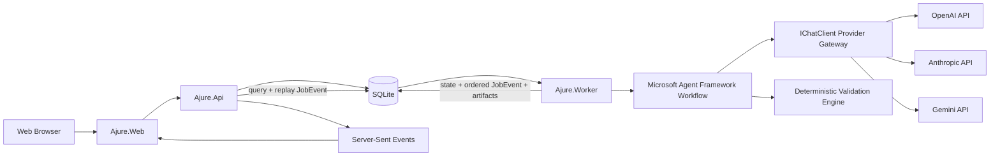

# TRD - 아주르

## 1. 목적과 경계

이 문서는 아주르 웹 앱의 구현 구조를 정의한다. 아주르의 실행 결과는 Markdown 명세이며 제품 소스 코드가 아니다.

### 필수 기술 조건

- Microsoft Agent Framework를 실제 작성·평가·회귀 워크플로에 사용한다.
- OpenAI GPT, Anthropic Claude, Google Gemini의 공식 HTTPS API를 직접 지원한다.
- 모델 호출 경계는 `IChatClient`로 표준화한다.
- 메타데이터, Job 큐, 이벤트, 산출물은 단일 SQLite 파일에 저장한다.
- Azure 서비스와 GitHub Copilot SDK를 요구하지 않는 셀프호스트 애플리케이션으로 제공한다.

### 설계 원칙

1. 문서 4종을 따로 생성하지 않고 하나의 `ProjectSpec`에서 렌더링한다.
2. LLM 평가만 신뢰하지 않고 결정적 검사와 외부 벤치마크를 함께 사용한다.
3. 작성자와 평가자의 컨텍스트 및 역할을 분리한다.
4. 사용자의 승인 버전은 불변으로 보존한다.
5. 모델에는 코드 작성, 셸 실행, 저장소 수정 도구를 제공하지 않는다.

## 2. 논리 아키텍처



## 3. 런타임 구성요소

### 3.1 `Ajure.Web`

- React, TypeScript, Vite 기반 SPA
- 아이디어 입력, 대상 선택, 질문 응답, 문서 편집, 점수/회귀 시각화 담당
- Markdown 렌더러와 안전한 텍스트 편집기를 제공
- API 이외의 모델/저장소 자격증명을 보유하지 않음

### 3.2 `Ajure.Api`

- ASP.NET Core API
- 인증, 프로젝트/버전 조회, Job 생성, 문서 편집, 내보내기 담당
- SQLite에 저장된 `JobEvent`를 Server-Sent Events(SSE)로 재생해 진행 상태 전달
- `Last-Event-ID` 이후 이벤트를 재생하므로 새로고침과 API 재시작 후에도 이어보기 지원
- 모델 호출과 장시간 검증은 직접 수행하지 않고 SQLite Job 큐에 위임

### 3.3 `Ajure.Worker`

- Queue 기반 장시간 Job 실행
- Microsoft Agent Framework 워크플로 실행
- 결정적 검사, LLM 평가, 보정, 렌더링, 스냅샷 저장 담당
- Job ID를 멱등 키로 사용
- 각 상태 전이 전에 단조 증가 sequence를 가진 `JobEvent`를 영속 저장

### 3.4 `Ajure.Agent`

- Agent Framework 에이전트 정의와 워크플로 그래프
- 프롬프트 템플릿, 구조화 출력 계약, 역할별 컨텍스트 제한
- 코드나 셸 도구를 등록하지 않음

### 3.5 `Ajure.Specification`

- `ProjectSpec` 도메인 모델
- 요구사항 그래프, 렌더러, 영향 분석, 의미 diff
- AI 제공자에 의존하지 않는 순수 애플리케이션 로직

### 3.6 `Ajure.Validation`

- 스키마, 추적성, 필수 섹션, 파일 경로, 버전 해시 등 결정적 검사
- 평가 결과 집계와 Hard Gate 판정
- [EVALUATION.md](EVALUATION.md)의 산식을 단일 기준으로 구현

### 3.7 `Ajure.Infrastructure`

- SQLite 엔터티/Blob/Job 큐와 lease 구현
- OpenAI, Anthropic, Gemini 직접 API 연결과 `IChatClient` 어댑터
- 서버 환경 변수 및 user-secrets 기반 공급자 설정
- 대상 도구 템플릿 레지스트리 로더

### 3.8 `Ajure.AppHost` / `Ajure.ServiceDefaults`

- AppHost는 Web, API, Worker를 함께 시작하는 선택적 로컬 개발 실행기
- API와 Worker에 동일한 절대 SQLite 경로 전달
- Health Check와 OpenTelemetry 기본값 선언
- 운영 배포는 AppHost나 특정 클라우드에 의존하지 않음

## 4. Microsoft Agent Framework 워크플로

### 4.1 에이전트 역할

| 에이전트 | 입력 | 출력 | 책임 |
|---|---|---|---|
| Intake Agent | 사용자 원문 | 구조화 Brief | 사실, 선호, 제약 추출 |
| Ambiguity Agent | Brief | Decision 목록 | 구현 결과를 바꾸는 미결정 사항 분류 |
| Spec Architect | 승인된 Decision | `ProjectSpec` 초안 | 목표, 요구사항, 수용 기준, 기술 결정 생성 |
| Product Reviewer | ProjectSpec | Product Findings | 사용자 흐름, 범위, 수용 가능성 검사 |
| Technical Reviewer | ProjectSpec | Technical Findings | 구조, 데이터, API, 보안, 운영 가능성 검사 |
| UX Reviewer | ProjectSpec | UX Findings | 상태, 반응형, 접근성, 상호작용 누락 검사 |
| Implementation Simulator | ProjectSpec + Target | Simulation Findings | 코드를 쓰지 않고 예상 구현 작업/파일 지도를 만들어 빈틈 탐지 |
| Regression Reviewer | Base + Candidate | Regression Findings | 요구사항 손실, 약화, 충돌 검사 |
| Repair Agent | Findings + ProjectSpec | 수정된 ProjectSpec | 사용자 결정이 불필요한 결함만 보정 |
| Target Adapter Agent | 검증된 ProjectSpec | 대상 지침 payload | 도구별 실행 계약 렌더링 입력 생성 |

### 4.2 상태 그래프

```text
Draft
  -> Analyzing
  -> NeedsDecision (Critical 질문 존재)
  -> Generating
  -> DeterministicValidation
  -> IndependentReview
  -> RegressionValidation (기준 버전이 있을 때)
  -> Repairing (최대 3회)
  -> Ready

실패 분기:
  Any State -> RetryableFailure -> 이전 체크포인트
  Any State -> TerminalFailure
  Validation -> NeedsDecision
```

### 4.3 역할 분리

- Spec Architect가 자신의 결과에 최종 합격 판정을 내리지 못하게 한다.
- Reviewer는 작성자의 숨은 추론이나 대화 전체를 받지 않고 `ProjectSpec`과 명시된 평가 기준만 받는다.
- 구현 시뮬레이터는 소스 코드를 생성하지 않고 작업 분해, 의존성, 예상 파일, 검증 항목만 구조화해 반환한다.
- Repair Agent는 Finding이 가리키는 범위 밖의 제품 결정을 바꾸지 못한다.

## 5. 직접 모델 API와 `IChatClient` 사용

### 5.1 공급자 레지스트리

`Ajure.Infrastructure`의 모델 게이트웨이가 구성된 공급자를 `IModelGateway`와 `IChatClient` 경계 뒤에 노출한다.

| 공급자 | API | API 키 | 모델 ID |
|---|---|---|---|
| OpenAI GPT | Chat Completions | `OPENAI_API_KEY` | `AJURE_OPENAI_MODEL` |
| Anthropic Claude | Messages | `ANTHROPIC_API_KEY` | `AJURE_ANTHROPIC_MODEL` |
| Google Gemini | `generateContent` | `GEMINI_API_KEY` | `AJURE_GEMINI_MODEL` |

- 세 공급자를 동시에 구성할 수 있고, 키와 모델 ID가 모두 있는 공급자만 사용 가능 목록에 포함한다.
- 내부 모델 ID는 `openai:{model}`, `anthropic:{model}`, `gemini:{model}`처럼 공급자 한정 형식으로 저장한다.
- API 키는 서버 환경 변수 또는 .NET user-secrets에서만 읽고 애플리케이션 데이터나 Telemetry에 저장하지 않는다.
- 공급자별 공식 HTTPS 엔드포인트와 인증 헤더를 사용한다.
- 시작 시 구성된 모델이 2개 미만이면 실제 모델 Job을 `model_diversity_unavailable`로 실패시킨다.
- 작성 및 Reviewer 역할마다 독립 요청 ID를 만들고 공급자, 모델 ID, 요청 ID를 실행 기록에 저장한다.
- 선택된 공급자의 인증, 할당량, 정책 또는 API 오류를 다른 공급자의 성공으로 대체하지 않는다.

### 5.2 코드 작성 방지

- Agent Framework 에이전트에 파일 쓰기, 셸, Git, 배포 도구 또는 함수 도구를 등록하지 않는다.
- 공급자 API에는 system/developer 지침과 사용자 프롬프트만 전송한다.
- 공급자 대화 저장 기능을 사용하지 않고 역할별 요청은 stateless로 실행한다.
- 출력은 Markdown 또는 구조화된 `ProjectSpec` 스키마만 허용한다.
- 코드 펜스가 필요한 경우 API 계약/데이터 예시/디렉터리 구조로 용도를 제한한다.
- 실제 제품 구현을 요청받아도 Spec Architect가 요구사항으로 변환한다.

### 5.3 `IChatClient` 경계

Agent Framework의 `ChatClientAgent`/`AsAIAgent` 패턴과 호환되도록 모델 호출을 `IChatClient` 중심으로 구성한다. 얇은 공급자 게이트웨이를 `Ajure.Infrastructure`에 두며 워크플로와 검증 코드는 공급자별 HTTP 형식을 알지 못한다.

어댑터 책임:

- 공통 모델 요청을 공급자별 JSON과 인증 헤더로 변환
- 공급자 응답의 텍스트와 요청 ID를 표준 응답으로 변환
- 취소, 제한 시간, 429, 일시적 5xx, 인증 오류, 잘못된 응답을 구분
- 응답 본문과 API 키를 로그에 남기지 않음
- `HttpResponseMessage`와 취소 리소스 정리 보장

공급자 HTTP 계약은 구현 시 각 공급자의 공식 API 문서를 다시 확인해 잠근다.

MVP의 작성 및 평가는 구성된 직접 API를 사용하며, 평가 다양성은 서로 다른 공급자 한정 모델 ID로 확보한다. 배정된 공급자가 실패하면 Job은 명시적으로 실패한다.

### 5.4 P0 직접 공급자 API 로컬 실증 게이트

실제 모델 워크플로를 시작하기 전에 개발 호스트에서 다음 Probe를 통과해야 한다.

1. 환경 변수 또는 user-secrets에 OpenAI, Anthropic, Gemini 중 두 공급자 이상의 키와 모델 ID를 설정한다.
2. `ListModelsAsync`에서 공급자 한정 모델 ID 2개 이상을 확인한다.
3. 구성된 모든 공급자에 짧은 독립 요청을 동시에 보내 응답과 요청 ID를 확인한다.
4. 각 요청에 system/developer 지침이 적용되고 도구 정의가 전송되지 않는지 계약 테스트로 확인한다.
5. 인증 실패, 429/5xx, 취소, 제한 시간을 명시적 실패로 변환하는지 확인한다.
6. 로그와 오류 응답에 API 키나 모델 원문 응답이 없는지 확인한다.

이 게이트가 실패하면 B4 이후 실제 모델 워크플로를 진행하지 않고 원인을 명시한다.

### 5.5 셀프호스트 경계

- 운영에 필요한 외부 의존성은 운영자가 선택한 모델 공급자 API뿐이다.
- 애플리케이션은 Azure 계정, GitHub Copilot 구독, GitHub App 또는 관리형 비밀 저장소를 요구하지 않는다.
- API와 Worker는 같은 로컬 또는 영속 volume의 SQLite 파일을 사용한다.
- 단일 Worker 프로세스를 MVP 지원 범위로 두고 수평 확장이 필요해질 때 PostgreSQL 등 서버 데이터베이스로 전환한다.

## 6. 정규화된 명세 모델

### 6.1 주요 엔터티

```text
Project
  id, name, ownerId, locale, createdAt

SpecVersion
  id, projectId, number, status, baseVersionId, inputHash
  generationProfile, targetIds, createdAt, approvedAt

ProjectSpec
  vision, problem, personas[], goals[], nonGoals[]
  journeys[], requirements[], nonFunctionalRequirements[]
  acceptanceCriteria[], technicalDecisions[], uxDecisions[]
  risks[], glossary[], openDecisions[]

Requirement
  id, title, statement, priority, rationale
  acceptanceCriteriaIds[], technicalDecisionIds[], sourceDecisionIds[]

AcceptanceCriterion
  id, given, when, then, verificationType, requirementIds[]

TechnicalDecision
  id, title, decision, rationale, alternatives[], requirementIds[]

Artifact
  id, specVersionId, kind, targetId?, path, contentHash
  templateVersion, status, blobName

ValidationRun
  id, specVersionId, baseVersionId?, iteration, status
  score, hardGates[], findings[], startedAt, completedAt

JobEvent
  jobId, sequence, eventType, stage, status, summary
  occurredAt, retryable, correlationId
```

### 6.2 안정적인 ID

- 기능: `FR-001`
- 비기능: `NFR-001`
- 수용 기준: `AC-001`
- 기술 결정: `TD-001`
- UX 결정: `UX-001`
- 리스크: `RISK-001`

문구 수정만으로 ID가 바뀌지 않는다. 의미가 분리되거나 합쳐질 때는 변경 이벤트를 남긴다.

### 6.3 소스 오브 트루스

`ProjectSpec`이 유일한 의미 기준이다. Markdown을 직접 편집하면 파서가 변경 제안을 만들고, 승인 후 새 ProjectSpec 버전으로 반영한다. 렌더러는 새 버전에서 모든 영향을 받은 파일을 다시 만든다.

## 7. 문서 렌더링

### 7.1 렌더링 순서

1. ProjectSpec 스키마 검증
2. [DOCUMENT-SPEC.md](DOCUMENT-SPEC.md)에 따라 `IDEATION.md` 렌더링
3. 같은 규격에 따라 `PRD.md` 렌더링
4. 같은 규격에 따라 `TRD.md` 렌더링
5. 대상별 지침 payload 생성
6. 대상별 파일 어댑터 렌더링
7. 모든 파일의 버전/해시 매니페스트 저장

### 7.2 문서 우선순위

대상 지침 파일에 충돌 해결 순서를 포함한다.

1. 사용자 최신 명시 요청
2. 대상 지침 파일의 실행/검증 규칙
3. `PRD.md`의 제품 행동과 수용 기준
4. `TRD.md`의 기술 제약과 운영 조건
5. `IDEATION.md`의 배경과 의도

지침 파일이 제품 요구사항을 재정의하지 못하게 한다.

## 8. 검증 엔진

### 8.1 결정적 검사

- JSON 스키마 및 필수 필드
- 요구사항 ID 유일성
- FR/NFR -> AC 연결률
- FR/NFR -> TD 또는 “기술 영향 없음” 표기
- 문서별 필수 섹션
- 대상별 파일 경로와 frontmatter
- 동일 Spec Version과 content hash
- Critical Decision 미해결 여부
- 금지된 비밀/토큰 패턴
- 과도한 중복과 길이 예산

### 8.2 의미 검사

- 상충하는 사용자 흐름
- 정의되지 않은 도메인 용어
- 검증 불가능한 수용 기준
- UI 상태 누락
- 인증/권한/데이터 보존 누락
- 외부 연동의 실패/제한 처리 누락
- 기술 결정 없는 기능 요구사항
- 요구하지 않은 과도한 기술 구성

평가 결과의 모델 배정, 정규화, fingerprint, 합의, 타이브레이크와 보정 입력은 [EVALUATION.md](EVALUATION.md) §6을 단일 기준으로 구현한다.

### 8.3 회귀 검사

기준 버전의 요구사항 그래프와 후보 그래프를 비교한다.

- Removed: 요구사항이 사라짐
- Weakened: 조건/결과/검증 강도가 낮아짐
- Unlinked: 추적 관계가 끊김
- Contradicted: 새 결정이 기존 요구와 충돌
- StaleArtifact: 대상 파일이 이전 버전을 참조
- ApprovedChange: 사용자가 명시적으로 승인한 변경

세부 산식은 [EVALUATION.md](EVALUATION.md)를 따른다.

## 9. API 설계

| Method | Path | 목적 |
|---|---|---|
| `POST` | `/api/projects` | 프로젝트 생성 |
| `GET` | `/api/projects` | 프로젝트 목록 |
| `GET` | `/api/projects/{projectId}` | 프로젝트 상세 |
| `POST` | `/api/projects/{projectId}/analyze` | 원문 분석 Job 시작 |
| `GET` | `/api/projects/{projectId}/decisions` | 질문/결정 목록 |
| `PUT` | `/api/projects/{projectId}/decisions/{id}` | 답변 또는 추천값 승인 |
| `POST` | `/api/projects/{projectId}/versions` | 새 명세 버전 생성 |
| `POST` | `/api/spec-versions/{versionId}/generate` | 생성/검증 Job 시작 |
| `GET` | `/api/jobs/{jobId}` | Job 상태 |
| `GET` | `/api/jobs/{jobId}/events` | SSE 진행 이벤트 |
| `GET` | `/api/spec-versions/{versionId}/artifacts` | 문서 목록 |
| `GET` | `/api/artifacts/{artifactId}` | 문서 내용 |
| `PUT` | `/api/artifacts/{artifactId}` | 사용자 편집 제안 저장 |
| `POST` | `/api/spec-versions/{versionId}/validate` | 재검증 |
| `GET` | `/api/validation-runs/{runId}` | 점수/게이트/Finding |
| `GET` | `/api/spec-versions/{versionId}/diff/{baseId}` | 버전 의미 diff |
| `POST` | `/api/spec-versions/{versionId}/export` | Ready ZIP 생성 |

### 오류 형식

모든 오류는 `code`, `message`, `correlationId`, `retryable`, `details`를 가진 Problem Details 형식을 사용한다. 모델 원문 오류나 자격증명은 응답하지 않는다.

### SSE 재연결 규칙

- Worker는 상태를 사용자에게 노출하기 전에 `JobEvent`를 저장한다.
- 이벤트 ID는 Job 내에서 단조 증가하는 sequence다.
- API는 연결 시 `Last-Event-ID` 이후 이벤트를 먼저 재생한 뒤 1초 간격으로 새 행을 조회한다.
- 15초마다 heartbeat를 보내 중간 프록시의 idle timeout을 방지한다.
- Terminal event 이후 스트림을 닫는다.
- 이 구조는 in-memory backplane에 의존하지 않아 API 재시작 후에도 SQLite의 저장 이벤트부터 재연결할 수 있다.

## 10. 저장소 설계

### SQLite 파일

- 기본 경로는 `AJURE_DATA_PATH`로 지정하고 API와 Worker가 동일한 절대 경로를 사용한다.
- WAL 모드, foreign key, busy timeout을 활성화한다.
- Project, SpecVersion, Decision, Job, JobEvent, Artifact, ValidationRun은 JSON payload와 조회용 키를 저장한다.
- Markdown 산출물, Export ZIP, 평가 리포트는 Blob 테이블의 BLOB 열에 저장한다.
- 스키마 생성은 멱등이어야 하며 애플리케이션 시작 전에 완료한다.

### SQLite Job 큐

- Analyze, Generate, Validate, Export Job 메시지는 식별자만 포함한다.
- dequeue는 트랜잭션에서 가장 오래된 visible 메시지 하나를 lease하고 `dequeueCount`를 증가시킨다.
- lease 만료 전에는 다른 Worker가 같은 메시지를 가져갈 수 없다.
- 일시적 실패는 지수 백오프 뒤 다시 visible 상태로 만들고 최대 재시도 이후 Poison 테이블로 이동한다.
- `JobEvent.sequence` 배정과 Job의 `lastSequence` 갱신은 하나의 트랜잭션에서 수행한다.

SQLite는 단일 호스트·단일 Worker MVP에 맞춘다. 다중 Worker 또는 높은 쓰기 처리량이 실제로 필요해질 때 같은 저장소 facade 뒤에서 PostgreSQL로 전환한다.

## 11. 보안 및 개인정보

- 인증은 MVP에서 GitHub OAuth/OIDC를 우선한다.
- 사용자 로그인용 OAuth 토큰과 모델 공급자 API 키를 분리한다.
- 모델 API 키는 서버 환경 변수 또는 .NET user-secrets에서 읽고 SQLite에 저장하지 않는다.
- 사용자의 OAuth 토큰을 모델 호출 자격증명으로 재사용하지 않는다.
- 공급자 API 통신은 HTTPS만 허용한다.
- 사용자 입력은 프로젝트 소유자 기준으로 격리한다.
- Export는 권한을 확인한 API 스트림으로 전달한다.
- HTML 렌더링 시 Markdown 내 임의 HTML과 스크립트를 제거한다.
- Prompt Injection 텍스트는 데이터로 구분하고 시스템/평가 규칙을 덮지 못하게 한다.
- 문서 보존 기간과 즉시 삭제 정책을 UI에 표시한다.
- 운영자는 SQLite 파일을 비공개 디렉터리에 두고 파일 권한과 디스크 암호화를 구성한다.

## 12. 신뢰성

- 각 단계 완료 후 체크포인트를 저장한다.
- 진행 이벤트는 append-only로 저장하고 마지막 sequence부터 재생한다.
- 재시도는 네트워크, 429, 일시적 5xx에 한정하고 지수 백오프를 사용한다.
- 인증 실패, 스키마 반복 실패, 정책 위반은 자동 재시도하지 않는다.
- Job Lease로 동일 작업의 동시 실행을 방지한다.
- 취소된 Job은 새 버전을 Ready로 승격하지 않는다.
- Repair는 최대 3회이며 동일 Finding이 반복되면 사용자 결정으로 전환한다.
- 평가자 상충에 대한 타이브레이크는 Validation Run당 1회로 제한한다.

## 13. 관측성

- OpenTelemetry Trace: API -> SQLite Queue -> Worker -> Agent step -> SQLite
- Metric:
  - 단계별 latency
  - 모델별 token/요청/실패율
  - 자동 보정 횟수
  - Hard Gate 실패 분포
  - Ready 도달 시간
  - 점수와 외부 벤치마크 결과의 상관
- Log:
  - ID, 상태 전이, 오류 코드만 기본 기록
  - 사용자 원문과 생성 문서 전체는 기록하지 않음

## 14. 셀프호스트 실행

### 14.1 선택적 AppHost

```text
Ajure.AppHost
  ├─ web (Ajure.Web)
  ├─ api (Ajure.Api)
  ├─ worker (Ajure.Worker)
  └─ shared AJURE_DATA_PATH
```

AppHost는 세 프로세스를 한 번에 시작하는 개발 편의 기능이다. SQLite는 별도 프로세스가 아니며 API와 Worker가 같은 파일 경로를 받는다. 운영 배포는 AppHost를 요구하지 않는다.

### 14.2 필수 운영 입력

- 쓰기 가능한 영속 데이터 디렉터리와 `AJURE_DATA_PATH`
- OpenAI, Anthropic, Gemini 중 두 공급자 이상의 API 키와 모델 ID
- API와 Worker용 .NET 런타임
- Web 빌드용 Node.js 또는 미리 빌드된 정적 파일
- 외부 공개 시 TLS와 인증을 담당하는 운영자 선택 reverse proxy

### 14.3 실행 흐름

1. 저장소를 clone하고 .NET/Node.js 의존성을 복원한다.
2. SQLite 절대 경로와 공급자 키/모델 ID를 환경 변수 또는 user-secrets로 설정한다.
3. API와 Worker를 같은 `AJURE_DATA_PATH`로 실행한다.
4. Web을 실행하거나 정적 빌드를 선택한 웹 서버에서 제공한다.
5. Fake E2E와 구성된 실제 공급자 Probe를 실행한다.
6. 외부 공개 시 TLS, 인증, 데이터 volume 백업을 구성한다.

프로젝트는 특정 클라우드용 인프라 정의를 포함하지 않는다. 운영자는 일반 VM, bare metal, OCI 런타임 등 원하는 호스트를 선택할 수 있다.

## 15. 제안 저장소 구조

```text
/
├─ README.md
├─ IDEATION.md
├─ PRD.md
├─ TRD.md
├─ DOCUMENT-SPEC.md
├─ AI-FILE-SPEC.md
├─ EVALUATION.md
├─ UX-SPEC.md
├─ src/
│  ├─ Ajure.AppHost/
│  ├─ Ajure.ServiceDefaults/
│  ├─ Ajure.Web/           # 프론트 담당이 별도 구현
│  ├─ Ajure.Api/
│  ├─ Ajure.Worker/
│  ├─ Ajure.Agent/
│  ├─ Ajure.Specification/
│  ├─ Ajure.Validation/
│  └─ Ajure.Infrastructure/
├─ tests/
│  ├─ Ajure.Specification.Tests/
│  ├─ Ajure.Validation.Tests/
│  ├─ Ajure.Api.IntegrationTests/
│  └─ Ajure.Agent.EvaluationTests/
└─ evals/
   ├─ datasets/
   ├─ rubrics/
   └─ baselines/
```

## 16. 테스트 전략

### 단위 테스트
- ID 안정성
- 요구사항 그래프
- 의미 diff 규칙
- 점수 산식과 Hard Gate
- 대상 경로/템플릿 렌더링

### 계약 테스트
- OpenAI, Anthropic, Gemini 요청/응답 변환과 인증 헤더
- `IChatClient` 오류/취소/스트리밍 동작
- ProjectSpec 구조화 출력 파싱
- 평가 실패와 Finding 0건의 구분
- 동일 입력의 Finding fingerprint, 집계, 점수 결정성

### 통합 테스트
- SQLite Queue -> Worker -> Blob/메타데이터 체크포인트
- queue lease, 재시도, poison 이동과 이벤트 sequence 원자성
- 생성 중 재시작 및 재시도
- SSE 이벤트 순서
- Export ZIP 경로와 파일 해시

### 에이전트 평가
- 고정 입력에 대한 필수 요구사항 보존
- 평가자 간 합의
- Prompt Injection 내성
- 동일 입력의 점수 변동 범위

### E2E 테스트
- 새 프로젝트에서 Ready ZIP까지
- 수동 편집 후 Stale/재검증
- 이전 버전 요구사항 삭제 회귀
- 다중 대상 파일 출력

## 17. 주요 기술 결정

| ID | 결정 | 이유 |
|---|---|---|
| TD-001 | ProjectSpec을 유일한 의미 기준으로 사용 | 문서 간 드리프트 방지 |
| TD-002 | Agent Framework로 명시적 워크플로 구성 | 필수 조건 충족 및 역할/상태 제어 |
| TD-003 | 직접 모델 API에 도구 정의를 전송하지 않고 Agent Framework에도 도구를 등록하지 않음 | 제품의 비코딩 경계 보장 |
| TD-004 | 결정적 검사 후 LLM 평가 | 비용 절감과 평가 신뢰성 향상 |
| TD-005 | Queue 기반 Worker | 장시간 작업, 재시도, 복구 |
| TD-006 | 단일 SQLite 파일로 메타데이터, Blob, Job 큐 저장 | 외부 인프라 없는 셀프호스트와 백업 단순성 |
| TD-007 | SSE 사용 | 단방향 진행 표시를 WebSocket보다 단순하게 구현 |
| TD-008 | 불변 승인 버전 | 신뢰 가능한 회귀 기준선 확보 |
| TD-009 | 서로 다른 모델 ID 2개 이상의 독립 평가와 결정적 Finding 집계 | 단일 모델 자기확증을 줄이고 재현 가능한 점수와 게이트 제공 |
| TD-010 | AppHost는 선택적 개발 실행기로만 사용하고 운영은 표준 프로세스로 실행 | 특정 클라우드와 오케스트레이터 종속 제거 |
| TD-011 | OpenAI, Anthropic, Gemini 공식 HTTPS API를 BCL `HttpClient`로 직접 호출 | 공급자 SDK와 Copilot runtime 종속 최소화 |

## 18. 구현 전 검증 항목

- OpenAI, Anthropic, Gemini API 키와 선택 모델의 사용 가능성
- 현재 Agent Framework 패키지의 안정 버전 및 Workflow API
- 각 공급자의 공식 요청/응답 계약, 제한 시간, 429/5xx 오류 형식
- 구성된 서로 다른 모델 ID 2개 이상 사용 가능 여부
- SQLite WAL과 queue lease의 단일 Worker 동작
- 대상 코딩 도구별 최신 지침 파일 규격

## 19. 공식 참고 문서

- Microsoft Agent Framework: <https://learn.microsoft.com/agent-framework/>
- `IChatClient`: <https://learn.microsoft.com/dotnet/ai/ichatclient>
- OpenAI Chat Completions API: <https://developers.openai.com/api/reference/resources/chat>
- Anthropic Messages API: <https://platform.claude.com/docs/en/api/messages>
- Gemini `generateContent` API: <https://ai.google.dev/api/generate-content>
- SQLite: <https://sqlite.org/docs.html>
- .NET Aspire: <https://learn.microsoft.com/dotnet/aspire/>
